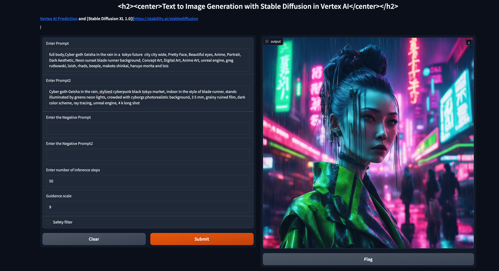

#  Deploy SDXL 1.0 on Vertex AI Prediction

This code shows how to **deploy a SDXL1.0 model** in Vertex AI Prediction with a A100 GPU. The model will be downloaded and embedded in a custom prediction image, using an [Uvicorn](https://www.uvicorn.org/) server. You will use a `a2-highgpu-1g` machine type with **1xA100 NVidia GPU** in **Vertex AI Prediction**.

A demo based on [Gradio](https://gradio.app/) and deployed in [Cloud Run](https://cloud.google.com/run) is also provided to easily make requests into the deployed model.


## The model: SDXL 1.0

[Released in July 2023](https://stability.ai/blog/stable-diffusion-sdxl-1-announcement), [Stable Diffusion XL 1.0](https://stablediffusionxl.com/) or SXDL 1.0 is the latest image generation model from Stability AI. Compared to previos versions, it has the following differences:

* **Better human anatomy**: Previous SD models had visible problems with generating correct human anatom.
* **Artistic styles**: SDXL offers several artistic styles for image generation, for example,  Photographic, Digital Art, Comic book, Fantasy art, Analog film, Neon punk, and many others.
* **Shorter prompts**: SDXL understands short prompts much better than the previous models.
* **Improved composition** in images.

SDXL is a latent diffusion model, where the diffusion operates in a pretrained, learned (and fixed) latent space of an autoencoder. 
While the bulk of the semantic composition is done by the latent diffusion model, local, high-frequency details in generated images can be improved by the quality of the autoencoder. In this case, we use the new `madebyollin/sdxl-vae-fp16-fix` which is as good as SDXL VAE but runs twice as fast and uses significantly less memory.
The model is downloaded from Hugging Face inside the container code, using the `.pre_trained()` method of the `diffusers.StableDiffusionXLPipeline` class. 

```py
model_base = "stabilityai/stable-diffusion-xl-base-1.0"
v_autoencoder = "madebyollin/sdxl-vae-fp16-fix" # fix vae for run in fp16 precision without generating NaNs

vae = AutoencoderKL.from_pretrained(v_autoencoder, torch_dtype=torch.float16)
pipe = StableDiffusionXLPipeline.from_pretrained(
    model_base,
    vae=vae,
    torch_dtype=torch.float16,
    use_safetensors=True,
    variant="fp16",
    add_watermarker=False, # no watermarker
    )
```

Model card [here](https://huggingface.co/stabilityai/stable-diffusion-xl-base-1.0) and paper [here](https://arxiv.org/abs/2307.01952).

SDXL 1.0 can be used online or offline:
* **Online** using Hugging Face, or any other tool, like Vertex AI Prediction as used in this post.
* **Offline** using ComfyUI or Automatic1111. Offline capabilities are out of scope of this post.

[Known limitations](https://huggingface.co/stabilityai/stable-diffusion-xl-refiner-1.0#limitations):
* The model does not achieve perfect photorealism.
* The model cannot render legible text.
* The model struggles with more difficult tasks which involve compositionality, such as rendering an image corresponding to “A red cube on top of a blue sphere”.
* Faces and people in general may not be generated properly.
* The autoencoding part of the model is lossy.


## Build Custom Prediction Container image 

A Custom Container image for predictions is required. A Custom Container image in Vertex AI [requires that the container must run an HTTP server](https://cloud.google.com/ai-platform-unified/docs/predictions/custom-container-requirements#image). Specifically, the container must listen and respond to liveness checks, health checks, and prediction requests. 

You will use a [Uvicorn](https://www.uvicorn.org/) server. You must build and push the container image to [Artifact Registry](https://cloud.google.com/artifact-registry):
```sh
gcloud auth configure-docker europe-west4-docker.pkg.dev
gcloud builds submit --tag europe-west4-docker.pkg.dev/argolis-rafaelsanchez-ml-dev/ml-pipelines-repo/sdxl10 --machine-type=e2-highcpu-8 --timeout="2h" 
```

This build process should take **less than 20 minutes**  with a `e2-highcpu-8`.


## Deploy the model to Vertex AI Prediction

Upload and deploy the image to Vertex AI Prediction using the provided script: `python3 upload_custom.py`. 

The upload and deploy process **may take up to 45 min**. Note the parameter `deploy_request_timeout` to avoid a `504 Deadline Exceeded` error during the deployment:
```python
from google.cloud import aiplatform

STAGING_BUCKET = 'gs://argolis-vertex-europewest4'
PROJECT_ID = 'argolis-rafaelsanchez-ml-dev'
LOCATION = 'europe-west4'

aiplatform.init(project=PROJECT_ID, staging_bucket=STAGING_BUCKET, location=LOCATION)

DEPLOY_IMAGE = 'europe-west4-docker.pkg.dev/argolis-rafaelsanchez-ml-dev/ml-pipelines-repo/sdxl10' 
HEALTH_ROUTE = "/health"
PREDICT_ROUTE = "/predict"
SERVING_CONTAINER_PORTS = [7080]

model = aiplatform.Model.upload(
    display_name=f'sdxl10 ',    
    description=f'sdxl10 model',
    serving_container_image_uri=DEPLOY_IMAGE,
    serving_container_predict_route=PREDICT_ROUTE,
    serving_container_health_route=HEALTH_ROUTE,
    serving_container_ports=SERVING_CONTAINER_PORTS,
)
print(model.resource_name)

# Retrieve a Model on Vertex
model = aiplatform.Model(model.resource_name)

# Deploy model 
# n1-standard-4 creates OOM and worker timeout killed issues
endpoint = model.deploy(
    machine_type="a2-highgpu-1g",
    accelerator_type="NVIDIA_TESLA_A100",
    accelerator_count = 1,
    traffic_split={"0": 100}, 
    min_replica_count=1,
    max_replica_count=1,
    traffic_percentage=100,
    deploy_request_timeout=1200,
    sync=True,
)
endpoint.wait()
```

Some pages shows that minimum requirements for SDXL1.0 are 4 vCPU and 16 GB RAM (which is equivalent to `n1-standard-4`). However, we got some OOM and Uvicorn worker crashes that suggested to use bigger machines. It worked well with a `n1-standard-16` and 1xT4 GPU however inference times were very slow, more than 60 seconds, which hits [a known limit in Vertex AI prediction](https://cloud.google.com/vertex-ai/docs/predictions/get-online-predictions#send-request).

To solve the 60 seconds timeout request issue, finally we decided to use a more powerful GPU, the A100 GPU. The [cost of a Vertex Prediction endpoint](https://cloud.google.com/vertex-ai/pricing#prediction-prices) (24x7) is splitted between **vCPU cost** (measured in vCPU hours), **RAM cost** (measured in GB hours) and **GPU cost** (measured in hours). In this case, we will use a `a2-highgpu-1g` (12 vCPU and 85 GB RAM) with `1xA100 GPU` (40 GB HBM) in `europe-west4` and the estimated cost is `(3.3741 + 0.0400223*12 + 0.0053636*85)*24 = 103 USD per day`.


## Model garden

Model garden in Vertex AI is a single place to search, discover, and interact with a wide variety of models from Google and others, including open source models. As of today, the following versions of Stable Diffusion are available  in Model garden, including sample code (notebooks) and technical information about each model:

* Stable Diffusion XL 1.0
* Stabble Difussion 2.1
* Stable Diffusion 1.5
* Keras version of Stable Diffusion


## Gradio demo UI

You are now ready to predict on the deployed model. You can use the REST API or the python SDK, but in this case you will build a simple demo UI using [Gradio](https://gradio.app/).

The Gradio app is built on [Cloud Run](https://cloud.google.com/run). You need to [build the docker first](https://docs.streamlit.io/knowledge-base/tutorials/deploy/docker), upload it to Artifact registry and then deploy it in Cloud Run:
```sh
gcloud builds submit --tag europe-west4-docker.pkg.dev/argolis-rafaelsanchez-ml-dev/ml-pipelines-repo/sdxl10-gradio 
gcloud run deploy sdxl10-gradio --port 8501 --image europe-west4-docker.pkg.dev/argolis-rafaelsanchez-ml-dev/ml-pipelines-repo/sdxl10-gradio --allow-unauthenticated --region=europe-west4 --platform=managed  
```

> NOTE: in the last two sections you have created two dockers, one **to host the SDXL model** (a custom container image which is then deployed in Vertex AI Prediction with 1xGPU) and the other one (the one in this section) **to host the Gradio app** in Cloud Run that will call the model. Unfortunately, we can not use a single docker with Cloud Run becuase Cloud Run does not support GPUs.

The Gradio app is now deployed in Cloud Run. You can test the provided examples or try yours. 




## References

`[1]` Research SDXL paper: [SDXL: Improving Latent Diffusion Models for High-Resolution Image Synthesis](https://arxiv.org/abs/2307.01952)      
`[2]` [SDXL 1.0 Weights](https://github.com/Stability-AI/generative-models)    
`[3]` Google Cloud Platform Github repo: [Deploy and host a Stable Diffusion model on Vertex AI](https://github.com/GoogleCloudPlatform/vertex-ai-samples/blob/main/notebooks/community/vertex_endpoints/torchserve/dreambooth_stablediffusion.ipynb)        
`[4]` [Stable Diffusion API](https://stablediffusionapi.com/)       

      


